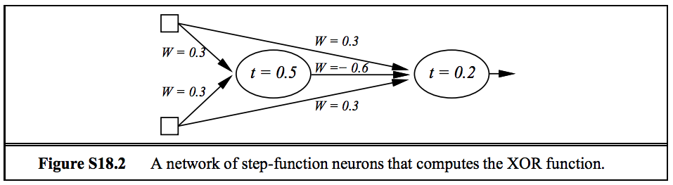

# Week 8 - Machine Learning - Learning with Boosting and Neural Nets - Solution

## Solutions

1. XOR (in fact any Boolean function) is easiest to construct using step-function units.  Because XOR is not linearly separable, we will need a hidden layer. It turns out that just one hidden node suffices. To design the network, we can think of the XOR function as OR with the AND case (both inputs on) ruled out. Thus the hidden layer computes AND, while the output layer computes OR but weights the output of the hidden node negatively. The network shown in Figure S18.2 does the trick. 

1. This is just a simple example of the general cross-validation model-selection method described in the chapter. For each possible size of hidden layer up to some reasonable bound, the k-fold cross-validation score is obtained given the existing training data and the best hidden layer size is chosen. This can be done using the AIMA code or with any of several public-domain machine learning toolboxes such as scikit-learn.

## Post

Post your solution to the Assignments folder as a PDF file by Sunday at Midnight.