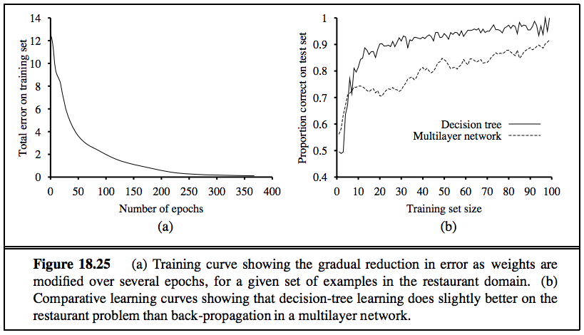

# Week 8 - Machine Learning - Learning with Boosting and Neural Nets

## Solve

1. Construct by hand a neural network that computes the XOR function of two inputs.  Make sure to specify what sort of units you are using.

1. The neural network whose learning performance is measured in Figure 18.25 has four hidden nodes. This number was chosen somewhat arbitrarily. Use a cross-validation method to find the best number of hidden nodes.  

## Post

Post your solution to the Assignments folder as a PDF file by Sunday at Midnight.
