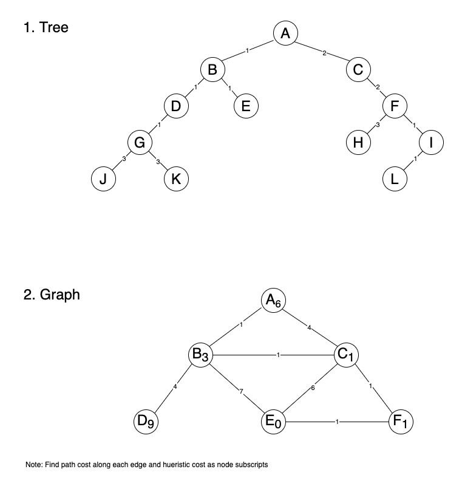

# Search Exercise Solution

## Answers

1. Search the tree and assume I is the goal.  Use alphabetic order of your data structures for uninformed searches and path cost for informed searches.  Use alphabetic order to break ties.  _In what order are the nodes expanded_?

    * DFS: __A, B, D, G, J, K, E, C, F, H, I__
    * BFS: __A, B, C, D, E, F, G, H, I__
    * UCS: __A, B, C, D, E, G, F, I__

2. Search the graph and assume E is the goal.  Use alphabetic order of your data structures for uninformed search and for informed search use path cost, heuristic estimate, or the combination as appropriate for the algorithm.  Use alphabetic order to break ties.  _What is the path to the goal and it's cost?_
`
    * DFS: __Path: A -> B -> E, Cost: 8__
    * HC: __Path: A -> C -> E, Cost: 10__
    * A*: __Path: A -> C -> F -> E, Cost: 6__

3. Is the heuristic in the graph _admissible_? __Yes, all heuristic are underestimates of the path cost to reach the goal.__  

4. Is the heuristic in the graph _consistent_? __No, the difference in the heuristic values for B and C is 2, and this is greater than path cost between them, which is 1.__
