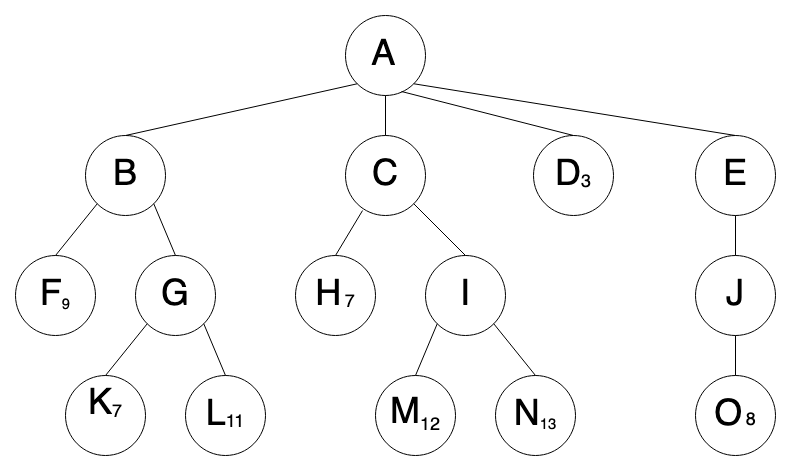

# Adversarial Search Exercise

## Minimax Algorithm

__function__ MINIMAX-DECISION(_state_) __returns__ _an action_  
&emsp;__return__ arg max _a_ &Element; ACTIONS(_s_) MIN\-VALUE(RESULT(_state_, _a_))  

__function__ MAX\-VALUE(_state_) __returns__ _a utility value_  
&emsp;__if__ TERMINAL\-TEST(_state_) __then return__ UTILITY(_state_)  
&emsp;_v_ &larr; &minus;&infin;  
&emsp;__for each__ _a_ __in__ ACTIONS(_state_) __do__  
&emsp;&emsp;&emsp;_v_ &larr; MAX(_v_, MIN\-VALUE(RESULT(_state_, _a_)))  
&emsp;__return__ _v_  

__function__ MIN\-VALUE(_state_) __returns__ _a utility value_  
&emsp;__if__ TERMINAL\-TEST(_state_) __then return__ UTILITY(_state_)  
&emsp;_v_ &larr; &infin;  
&emsp;__for each__ _a_ __in__ ACTIONS(_state_) __do__  
&emsp;&emsp;&emsp;_v_ &larr; MIN(_v_, MAX\-VALUE(RESULT(_state_, _a_)))  
&emsp;__return__ _v_

---

## Alpha-Beta Algorithm

__function__ MAX\-VALUE(_state_, _&alpha;_, _&beta;_) __returns__ _a utility value_  
&emsp;__if__ TERMINAL\-TEST(_state_) __then return__ UTILITY(_state_)  
&emsp;_v_ &larr; &minus;&infin;  
&emsp;__for each__ _a_ __in__ ACTIONS(_state_) __do__  
&emsp;&emsp;&emsp;_v_ &larr; MAX(_v_, MIN\-VALUE(RESULT(_state_, _a_), _&alpha;_, _&beta;_))  
&emsp;&emsp;&emsp;__if__ _v_ &ge; _&beta;_ __then return__ _v_  
&emsp;&emsp;&emsp;_&alpha;_ &larr; MAX(_&alpha;_, _v_)  
&emsp;__return__ _v_  

__function__ MIN\-VALUE(_state_, _&alpha;_, _&beta;_) __returns__ _a utility value_  
&emsp;__if__ TERMINAL\-TEST(_state_) __then return__ UTILITY(_state_)  
&emsp;_v_ &larr; &plus;&infin;  
&emsp;__for each__ _a_ __in__ ACTIONS(_state_) __do__  
&emsp;&emsp;&emsp;_v_ &larr; MIN(_v_, MAX\-VALUE(RESULT(_state_, _a_), _&alpha;_, _&beta;_))  
&emsp;&emsp;&emsp;__if__ _v_ &le; _&alpha;_ __then return__ _v_  
&emsp;&emsp;&emsp;_&beta;_ &larr; MIN(_&beta;_, _v_)  
&emsp;__return__ _v_  

---

## Problems

Apply the minimax algrothm to the game tree below.  Assume _max_ is currently taking its turn.  

* What sequence of moves should _max_ choose?  

* What many points will _max_ get?  

Now, apply the alpha-beta algorithm.

* Do you get the same result?

* How many nodes did you not have to evaluate?

---

### Problem 1

---

### Problem 2

