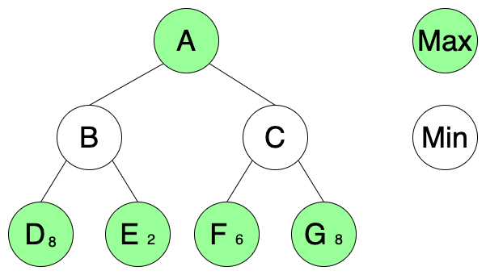

# Adversarial Search Exercise

Use this game tree graph to answer the questions below.  _Solve the problems by hand, not in code._  Use the videos posted in the Lecture section of the course on [Worldclass](https://worldclass.regis.edu) for demonstrations of the techniques required and the algorithms below to clarify your thinking.

---

## Questions

1. What value does alpha-beta pruning provide for adversarial search problems?  How does it relate to minimax search?  Please keep your answer to one paragraph.

__Alpha-beta pruning is a layer on top of mininmax search.  It returns the same answer as minimax search, only more efficiently.__
  

---

2. Using the MINIMAX algorithm, what value do you get for node A when searching _LEFT to RIGHT_?  Does it change if you search _RIGHT to LEFT_?

__6 and NO__

---

3. Using the ALPHA-BETA algorithm, what value do you get for node A when searching _LEFT to RIGHT_?  Does the value change if you search _RIGHT to LEFT_?  If so, what is value do you find?

__6 and NO__

---

4. Using the ALPHA-BETA PRUNING algorithm which nodes if any are pruned from the tree when searching from _LEFT to RIGHT_?  How about _RIGHT to LEFT_?

__None and D__

---

## Adversarial Search Algorithms

### Minimax Search

__function__ MINIMAX-DECISION(_state_) __returns__ _an action_  
&emsp;__return__ arg max _a_ &Element; ACTIONS(_s_) MIN\-VALUE(RESULT(_state_, _a_))  

__function__ MAX\-VALUE(_state_) __returns__ _a utility value_  
&emsp;__if__ TERMINAL\-TEST(_state_) __then return__ UTILITY(_state_)  
&emsp;_v_ &larr; &minus;&infin;  
&emsp;__for each__ _a_ __in__ ACTIONS(_state_) __do__  
&emsp;&emsp;&emsp;_v_ &larr; MAX(_v_, MIN\-VALUE(RESULT(_state_, _a_)))  
&emsp;__return__ _v_  

__function__ MIN\-VALUE(_state_) __returns__ _a utility value_  
&emsp;__if__ TERMINAL\-TEST(_state_) __then return__ UTILITY(_state_)  
&emsp;_v_ &larr; &infin;  
&emsp;__for each__ _a_ __in__ ACTIONS(_state_) __do__  
&emsp;&emsp;&emsp;_v_ &larr; MIN(_v_, MAX\-VALUE(RESULT(_state_, _a_)))  
&emsp;__return__ _v_  

---

### Alpha-Beta Search

__function__ ALPHA-BETA-SEARCH(_state_) __returns__ an action  
&emsp;_v_ &larr; MAX\-VALUE(_state_, &minus;&infin;, &plus;&infin;)  
&emsp;__return__ the _action_ in ACTIONS(_state_) with value _v_  

__function__ MAX\-VALUE(_state_, _&alpha;_, _&beta;_) __returns__ _a utility value_  
&emsp;__if__ TERMINAL\-TEST(_state_) __then return__ UTILITY(_state_)  
&emsp;_v_ &larr; &minus;&infin;  
&emsp;__for each__ _a_ __in__ ACTIONS(_state_) __do__  
&emsp;&emsp;&emsp;_v_ &larr; MAX(_v_, MIN\-VALUE(RESULT(_state_, _a_), _&alpha;_, _&beta;_))  
&emsp;&emsp;&emsp;__if__ _v_ &ge; _&beta;_ __then return__ _v_  
&emsp;&emsp;&emsp;_&alpha;_ &larr; MAX(_&alpha;_, _v_)  
&emsp;__return__ _v_  

__function__ MIN\-VALUE(_state_, _&alpha;_, _&beta;_) __returns__ _a utility value_  
&emsp;__if__ TERMINAL\-TEST(_state_) __then return__ UTILITY(_state_)  
&emsp;_v_ &larr; &plus;&infin;  
&emsp;__for each__ _a_ __in__ ACTIONS(_state_) __do__  
&emsp;&emsp;&emsp;_v_ &larr; MIN(_v_, MAX\-VALUE(RESULT(_state_, _a_), _&alpha;_, _&beta;_))  
&emsp;&emsp;&emsp;__if__ _v_ &le; _&alpha;_ __then return__ _v_  
&emsp;&emsp;&emsp;_&beta;_ &larr; MIN(_&beta;_, _v_)  
&emsp;__return__ _v_ 
