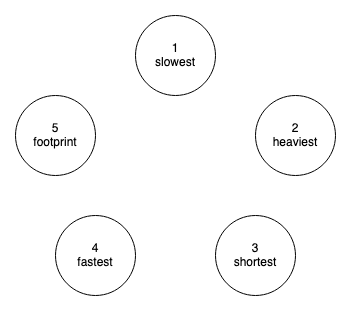

# Constraint Satisfaction Exercise

Use your knowledge of solving constraint satisfaction problems to answer questions on a multiple-choice test.  

## Questions

1. Which pokemon is the slowest?    &nbsp;&nbsp;&nbsp;&nbsp; A, B, C, D, E
1. Which pokemon is the heaviest?   &nbsp;&nbsp;&nbsp; A, B, C, D, E
1. Which pokemon is the shortest?   &nbsp;&nbsp; A, B, C, D, E
1. Which pokemon is the fastest?    &nbsp;&nbsp;&nbsp;&nbsp; A, B, C, D, E
1. Which pokemon is the footprint?  &nbsp; A, B, C, D, E

---

## Constraints

Here is what we know about each pokemon and their relations.

* 1 cannot be D
* 2, 3 and 4 cannot be A or E
* 5 cannot be D or E

_Fill out the domain table of possible values for each pokemon._

| Pokemon | A | B | C | D | E |
|---------|---|---|---|---|---|
| 1       |   |   |   |   |   |
| 2       |   |   |   |   |   |
| 3       |   |   |   |   |   |
| 4       |   |   |   |   |   |
| 5       |   |   |   |   |   |

We also know that:

* The fastest pokemon cannot be the slowest.
* The heaviest pokemon is the slowest.
* The shortest pokemon is neither the heaviest nor the fastest.
* The footprint belongs to the fastest pokemon.

Draw the constraint graph.

_Which pokemon is the most constrained?_ &nbsp; 1, 2, 3, 4, 5

---

## Searching for Answers

Find answers to the questions that are consistent with the constraints.

* Assign answers to question while not violating any constraints.
* Questions can have the same answer.
* Search in alphabetic order.

_Use __Depth First Search__ only check constraints after assignment and do not perform constraint propagation._ 

_Then try it again with __DFS + Forward Checking__ where you remove incompatible neighboring values after assignment._

_Finally, use the assignments from your search to answer the questions 1 to 5 above._

