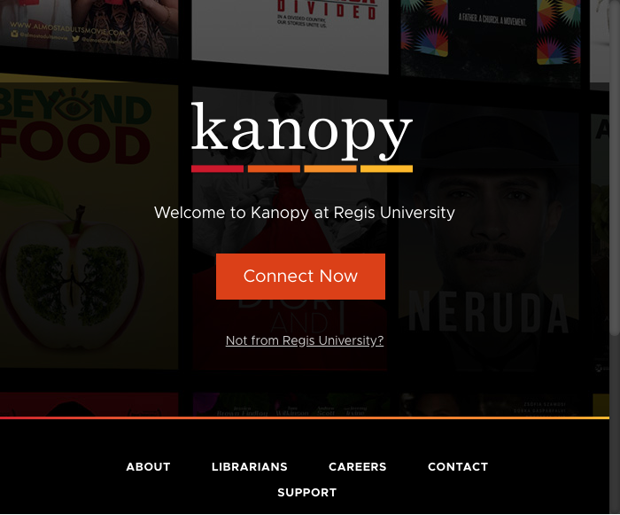
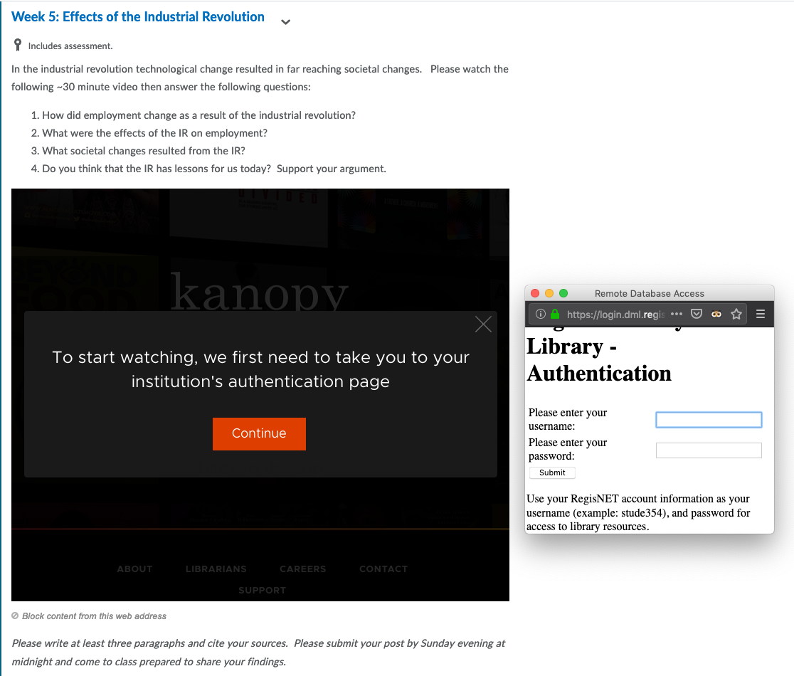
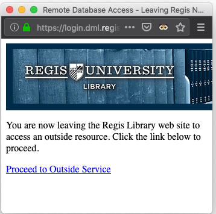

# How to access Canopy videos

Canopy is a video service that is available through the [Regis University Library](http://libguides.regis.edu/Library).  This is a simple set of instructions explaining how to access it.

1. Click on the *Connect Now* button 

2. Enter your Regis University credentials just like you do when logging into Worldclass.  

3. Click of the *Proceed to Outside Service* link 

4. Click the *Play or Arrow* button 
