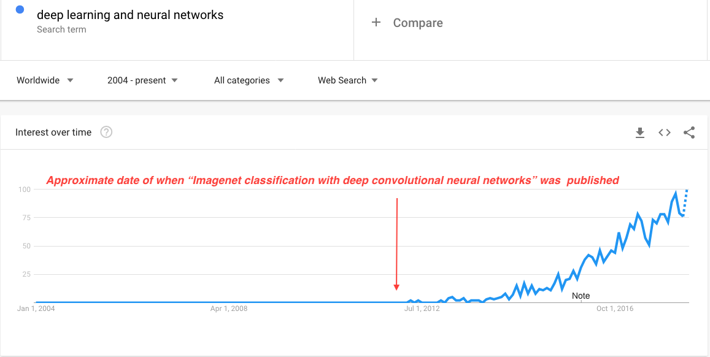

# Week 8 - More Machine Learning Models and Applications

1. Motivation: Continuing examination of machine learning in artificially intelligent systems.  This week we focus on neural networks and boosting.

1. Learning objectives
    1. Select models that do not perform well, remove them from consideration and those that are left are good-enough or _probably approximately correct_.

    1. Explain how neural network functions including the neurons, activation function, weights, forward propagation and back propagation.

    1. Summarize the relationship between the number of features in a model and the density of data points. 

    1. Illustrate boosting improves the performance of decision trees through the use of weak learners and decision stumps.

1. Readings
    1. Read Chapter 18 - Learning from Examples (18.5, 18.6, 18.7, 18.10 and 18.11)

    1. Text: Stuart Russel and Peter Norvig. _Artificial Intelligence: A Modern Approach_ (3rd ed). Prentice-Hall. 2010.

1. From the experts
    1. Watch: [Neural Nets](https://youtu.be/uXt8qF2Zzfo)

    1. Watch: [Deep Neural Nets](https://youtu.be/VrMHA3yX_QI)

    1. Read: [ImageNet Classification with Deep Convolutional Neural Networks](./resources/hinton_cnn_imagenet.pdf) - This paper demonstrates the effectiveness of deep CNN architecture for image recognition problems and catalyzed interest in deep neural networks.  The number of Google searches for deep neural networks through time.  

    1. Read: [Learning Internal Representations by Error Propagation](./resources/hinton_nn_back_prop_pdp8.pdf) - Neural network research had been stagnating for roughly 17 years.  This paper changed all that by showing the value of adding additional layers to a neural network.  It contains two very important results.  First, in the late 1960's it was thought that the inability of single layer neural networks to solve the [XOR problem](http://www.ece.utep.edu/research/webfuzzy/docs/kk-thesis/kk-thesis-html/node19.html) and represented a fundamental weakness.  The [solution](http://www.ece.utep.edu/research/webfuzzy/docs/kk-thesis/kk-thesis-html/node20.html) is to simply add a hidden layer to the neural network and use _feed-forward propagation_.  Second, using _back propagation_ to adjust weights and trains a neural network to fit the labeled data.  Through an iterative process the weights are adjusted until the error is minimized.

1. Discussion
    1. Read Section 26.3 - The Ethics and Risks of Developing Artificial Intelligence in our textbook.  Analyze the potential threats from AI technology to society.  What threats are the most serious, and how might they be combated?  How do they compare to the potential benefits?  _Support your position and post your discussion by midnight Wednesday.  Reply to three other students by midnight Sunday._

    1. First, watch [Google I/O 2018 Google's Duplex Demo Stole the Show](https://youtu.be/NO0-5MuJvew) on YouTube. Then discuss the whether, or not, you have ethical concerns about Google Duplex?  If so, what are they, and why?  If not, why not?  Please respond in a short essay (of no more than 300 words) supporting your position and cite supporting materials.  _Support your position and post your discussion by midnight Wednesday.  Reply to three other students by midnight Sunday._
